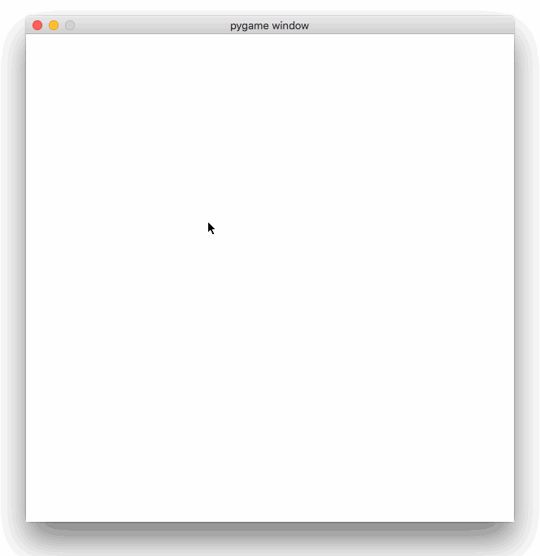

# YAGLIP: Yet Another Game of Life Implementation (in Python)

I have always been attracted to classical and bioinspired computer science games and methods, so I wanted to provide a very minimal Python implementation of the ["Game of Life"](https://en.wikipedia.org/wiki/Conway%27s_Game_of_Life), a cellular automaton devised by the British mathematician John Horton Conway in 1970. You'll only require [numpy](https://www.scipy.org/install.html) for the main game state handling and [pygame](http://www.pygame.org/wiki/GettingStarted) for the visualization and UI part.

The "game" is a zero-player game, meaning that its evolution is determined by its initial state, requiring no further input. One interacts with the Game of Life by creating an initial configuration and observing how it evolves.

The universe of the Game of Life is a two-dimensional orthogonal grid of square cells, each of which is in one of two possible states, alive or dead, or "populated" or "unpopulated". Every cell interacts with its eight neighbours, which are the cells that are horizontally, vertically, or diagonally adjacent. At each step in time, the following transitions occur:

1. Any live cell with fewer than two live neighbours dies, as if caused by underpopulation.
2. Any live cell with two or three live neighbours lives on to the next generation.
3. Any live cell with more than three live neighbours dies, as if by overpopulation.
4. Any dead cell with exactly three live neighbours becomes a live cell, as if by reproduction.

The initial pattern constitutes the seed of the system. Click on any cell to make it alive/die and press return when you want the game to start. Each generation is created by applying the above rules simultaneously to every cell in the previous state -births and deaths occur simultaneously, and the discrete moment at which this happens is sometimes called a tick (in other words, each generation is a pure function of the preceding one). The rules continue to be applied repeatedly to create further generations.